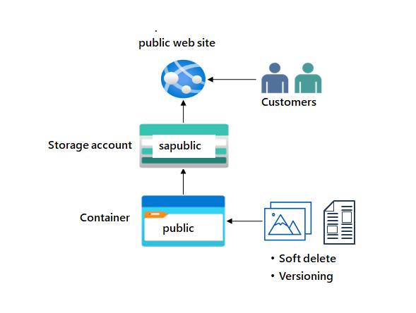

---
lab:
  title: 'Ejercicio 2a: Proporcionar almacenamiento para el sitio web público'
  module: Guided Project - Azure Files and Azure Blobs
---

El sitio web de la empresa proporciona imágenes de productos, vídeos, documentación de marketing y casos de éxito de clientes. Los clientes se encuentran en todo el mundo y la demanda está creciendo rápidamente. El contenido es crítico y requiere tiempos de carga de baja latencia. Es importante realizar un seguimiento de las versiones del documento y restaurar rápidamente los documentos si se eliminan.

## Diagrama de la arquitectura

## Tareas de aptitudes
- Cree un conjunto de disponibilidad y una cuenta de almacenamiento
- Asegúrese de que la cuenta de almacenamiento tiene un acceso público anónimo.
- Cree un contenedor de Blob Storage para los documentos del sitio web.
- Habilite la eliminación temporal para que los archivos se puedan restaurar fácilmente.
- Habilite el control de versiones de blobs. 

## Instrucciones del ejercicio

## Cree un conjunto de disponibilidad y una cuenta de almacenamiento

1. Cree una cuenta de almacenamiento para admitir el sitio web público.

    - En el portal, busque y seleccione `Storage accounts`.  
    - Seleccione **+ Create** (+ Crear). 
    - En **Grupo de recursos**, seleccione **Nuevo**. Escriba un **nombre** para el grupo de recursos y seleccione **Aceptar**. 
    - Establezca el **Nombre principal de la cuenta de almacenamiento** en `publicwebsite`. Asegúrese de que el nombre de la cuenta de almacenamiento es único agregando un identificador.
    - Acepte los valores predeterminados para las demás configuraciones. 
    - Seleccione **Revisar** y, después, **Crear**.
    - Espere a que se implemente la cuenta de almacenamiento y, después, seleccione **Ir al recurso**.
         
1. Este almacenamiento requiere alta disponibilidad si hay una interrupción regional. Además, habilite el acceso de lectura a la región secundaria. Obtenga más información sobre la [redundancia de la cuenta de almacenamiento](https://learn.microsoft.com/azure/storage/common/storage-redundancy#geo-redundant-storage).

    - En el panel Cuenta de almacenamiento, en la sección **Administración de datos**, seleccione la hoja **Redundancia**. 
    - Asegúrese de que el **almacenamiento con redundancia geográfica con acceso de lectura** está seleccionado.
    - Revise la información de ubicación principal y secundaria. 

1. La información del sitio web público debe ser accesible sin necesidad de que los clientes inicien sesión.
    - En la cuenta de almacenamiento, en la sección **Configuración**, seleccione la hoja **Configuración**.
    - Asegúrese de que la opción **Permitir acceso anónimo de blobs** esté **habilitada**.
    - Asegúrese de **Guardar** los cambios. 
  
   
## Cree un contenedor de Blob Storage con acceso de lectura anónimo

1. El sitio web público tiene varias imágenes y documentos. Cree un contenedor Blob Storage para el contenido. Obtenga más información sobre los [contenedores de almacenamiento](https://learn.microsoft.com/azure/storage/blobs/storage-blobs-introduction#containers).
    - En su cuenta de almacenamiento, en la sección **Almacenamiento de datos**, seleccione la hoja **Contenedores**. 
    - Seleccione **+ Contenedor**. 
    - Asegúrese de que el **Nombre** del contenedor es `public`. 
    - Seleccione **Crear**. 
    
1. Los clientes deben poder ver las imágenes sin autenticarse. Configure el acceso de lectura anónimo para los blobs de contenedor públicos.  Obtenga más información sobre [cómo configurar el acceso público anónimo](https://learn.microsoft.com/azure/storage/blobs/anonymous-read-access-configure?tabs=portal).
    - Seleccione el contenedor **público**. 
    - En la hoja **Información general**, seleccione **Cambiar nivel de acceso**. 
    - Asegúrese de que el **Nivel de acceso público** sea **Blob (acceso de lectura anónimo solo para blobs)**.
    - Seleccione **Aceptar**. 

## Practique la carga de archivos y el acceso de prueba.

1. Para realizar una prueba, cargue un archivo en el contenedor **público**. El tipo de archivo es indiferente. Una pequeña imagen o archivo de texto es una buena opción.  
    - Asegúrese de que está viendo el contenedor. 
    - Seleccione **Cargar**. 
    - **Vaya a los archivos** y seleccione un archivo. Vaya al archivo que prefiera. 
    - Seleccione **Cargar**.
    - Cierre la ventana de carga, **actualice** la página y asegúrese de que se cargó el archivo. 

1. Determine la dirección URL del archivo cargado. Abra un explorador y pruebe la dirección URL. 
    - Seleccione el archivo cargado.
    - En la pestaña **Información general**, copie la **dirección URL**.
    - Pegue la dirección URL en una pestaña nueva del explorador.
    - Si ha cargado un archivo de imagen, se mostrará en el explorador. Se deben descargar otros tipos de archivo. 

## Configure la eliminación temporal

1. Es importante que los documentos del sitio web se puedan restaurar si se eliminan. Configure la eliminación temporal de blobs durante 21 días. Obtenga más información sobre la [eliminación temporal de blobs](https://learn.microsoft.com/azure/storage/blobs/soft-delete-container-enable?tabs=azure-portal)
    - Vaya a la hoja **Información general** de la **cuenta de almacenamiento**.
    - En la página **Propiedades**, busque la sección **Blob service** 
    - Seleccione la opción **Eliminación temporal de blobs**.
    - Asegúrese de que la opción **Habilitar eliminación temporal para blobs** está **activada**.
    - Cambie el valor **Conservar los blobs eliminados durante (en días)** a **21**.
    - Tenga en cuenta que también puede **habilitar la eliminación temporal para contenedores**. 
    - No olvide **guardar** los cambios. 

1. Si algo se elimina, debe practicar el uso de la eliminación temporal para restaurar los archivos.
    - Vaya al contenedor donde cargó un archivo.
    - Seleccione el archivo y, después, seleccione **Eliminar**.
    - Seleccione **Aceptar** para confirmar la eliminación.  
    - En la página **Información general** del contenedor, active el control deslizante **Mostrar blobs eliminados**. Este botón de alternancia está a la derecha del cuadro de búsqueda. 
    - Seleccione el archivo eliminado y use los puntos suspensivos en el extremo derecho para **Recuperar** el archivo. 
    - Actualice el contenedor y confirme que se ha restaurado el archivo.     

## Configuración del control de versiones de blobs
1. Es importante realizar un seguimiento de las diferentes versiones de la documentación del producto. Obtenga más información sobre el [control de versiones de blobs](https://learn.microsoft.com/azure/storage/blobs/versioning-enable?tabs=portal).
    - Vaya a la hoja **Información general** de la **cuenta de almacenamiento**.
    - En la sección **Propiedades**, busque la sección **Blob service**.
    - Seleccione la opción **Control de versiones**.
    - Asegúrese de que la casilla **Habilitar control de versiones para blobs** está activada.
    - Observe las opciones para **mantener todas las versiones** o **eliminar versiones después**. 
    - No olvide **guardar** los cambios. 

1. Como tiene tiempo, experimente con la restauración de versiones anteriores de blobs.
   - **Cargue** otra versión del archivo de contenedor. Esto sobrescribirá el archivo existente. 
   - La versión del archivo anterior aparece en la página **Mostrar blobs eliminados**. 
    

